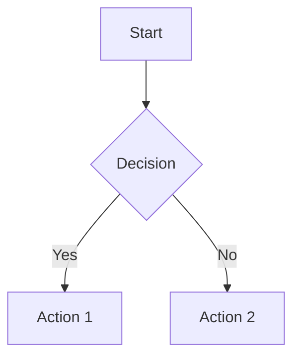

# Obsidian

## Overview

This skill provides comprehensive guidance for working with Obsidian,
a powerful knowledge management and note-taking application.
It covers vault structure, the Obsidian API for plugin development,
URI scheme automation, markdown extensions, and integration with
external tools via the Local REST API.

## Quick Reference

### Vault Structure

```text
my-vault/
├── .obsidian/              # Configuration folder
│   ├── app.json            # App settings
│   ├── appearance.json     # Theme settings
│   ├── community-plugins.json  # Installed plugins list
│   ├── core-plugins.json   # Core plugin toggles
│   ├── hotkeys.json        # Custom keybindings
│   ├── plugins/            # Plugin data folders
│   │   └── <plugin-id>/
│   │       ├── main.js     # Compiled plugin code
│   │       ├── manifest.json
│   │       └── data.json   # Plugin settings
│   └── workspace.json      # Layout state
├── Notes/                  # User notes (any structure)
├── Attachments/            # Images, PDFs, etc.
└── Templates/              # Template files
```

### Obsidian URI Scheme

Native Obsidian supports `obsidian://` protocol for automation:

```bash
# Open a vault
obsidian://open?vault=MyVault

# Open a specific file
obsidian://open?vault=MyVault&file=Notes/MyNote

# Create a new note
obsidian://new?vault=MyVault&name=NewNote&content=Hello

# Search the vault
obsidian://search?vault=MyVault&query=keyword

# Open daily note
obsidian://daily?vault=MyVault
```

### URI Parameters

| Parameter | Description |
|-----------|-------------|
| `vault` | Vault name (required) |
| `file` | File path without `.md` extension |
| `path` | Full file path including folders |
| `name` | Note name for creation |
| `content` | Content to insert |
| `query` | Search query |
| `heading` | Navigate to heading |
| `block` | Navigate to block reference |

## Workflow Decision Tree

```text
What do you need to do?
├── Automate Obsidian from external tools?
│   ├── Simple open/create operations?
│   │   └── Use: Native obsidian:// URI scheme
│   ├── Complex automation (append, prepend, commands)?
│   │   └── Use: Advanced URI plugin
│   └── Full programmatic access?
│       └── Use: Local REST API plugin
├── Build a plugin for Obsidian?
│   └── See: Plugin Development section
├── Work with vault files directly?
│   └── Use: obsidian-cli or direct file operations
├── Extend markdown syntax?
│   └── See: Markdown Extensions section
└── Query notes and metadata?
    └── Use: Local REST API or Dataview plugin
```

## Plugin Development

### Plugin Structure

```text
my-plugin/
├── main.ts           # Plugin entry point
├── manifest.json     # Plugin metadata
├── package.json      # npm dependencies
├── styles.css        # Optional styles
├── tsconfig.json     # TypeScript config
└── esbuild.config.mjs # Build config
```

### manifest.json

```json
{
  "id": "my-plugin",
  "name": "My Plugin",
  "version": "1.0.0",
  "minAppVersion": "1.0.0",
  "description": "A sample plugin for Obsidian",
  "author": "Your Name",
  "authorUrl": "https://github.com/username",
  "isDesktopOnly": false
}
```

### Basic Plugin Template

```typescript
import { Plugin, Notice, MarkdownView } from 'obsidian';

export default class MyPlugin extends Plugin {
  async onload() {
    console.log('Loading plugin');

    // Register a command
    this.addCommand({
      id: 'my-command',
      name: 'My Command',
      callback: () => {
        new Notice('Hello from my plugin!');
      }
    });

    // Register editor command
    this.addCommand({
      id: 'my-editor-command',
      name: 'Insert Text',
      editorCallback: (editor, view: MarkdownView) => {
        editor.replaceSelection('Inserted text');
      }
    });

    // Register event listener
    this.registerEvent(
      this.app.workspace.on('file-open', (file) => {
        if (file) {
          console.log('Opened:', file.path);
        }
      })
    );
  }

  onunload() {
    console.log('Unloading plugin');
  }
}
```

### Core API Classes

| Class | Purpose | Access |
|-------|---------|--------|
| `App` | Central application instance | `this.app` |
| `Vault` | File system operations | `this.app.vault` |
| `Workspace` | Pane and layout management | `this.app.workspace` |
| `MetadataCache` | File metadata indexing | `this.app.metadataCache` |
| `FileManager` | User-safe file operations | `this.app.fileManager` |

### Plugin Lifecycle

```typescript
// onload() - Called when plugin is enabled
async onload() {
  // Initialize UI components
  // Register event handlers
  // Set up commands
  // Load settings
}

// onunload() - Called when plugin is disabled
onunload() {
  // Cleanup is mostly automatic
  // Custom cleanup for external resources
}
```

## Local REST API

The Local REST API plugin provides HTTP endpoints to interact with Obsidian programmatically.

### Installation

1. Install "Local REST API" from Community Plugins
2. Enable the plugin
3. Configure API key in settings
4. Default endpoint: `https://127.0.0.1:27124`

### Authentication

```bash
# Using API key header
curl -H "Authorization: Bearer YOUR_API_KEY" \
     https://127.0.0.1:27124/vault/
```

### Common Endpoints

```bash
# List all files
GET /vault/

# Get file content
GET /vault/{path-to-file}

# Create/Update file
PUT /vault/{path-to-file}
Content-Type: text/markdown
Body: File content here

# Delete file
DELETE /vault/{path-to-file}

# Search vault
POST /search/simple/
Content-Type: application/json
Body: {"query": "search term"}

# Execute command
POST /commands/{command-id}

# Get active file
GET /active/

# Open file in Obsidian
POST /open/{path-to-file}
```

### Python Example

```python
import requests

class ObsidianAPI:
    def __init__(self, api_key, base_url="https://127.0.0.1:27124"):
        self.base_url = base_url
        self.headers = {
            "Authorization": f"Bearer {api_key}",
            "Content-Type": "application/json"
        }
        self.session = requests.Session()
        self.session.verify = False  # Self-signed cert

    def list_files(self, path=""):
        response = self.session.get(
            f"{self.base_url}/vault/{path}",
            headers=self.headers
        )
        return response.json()

    def read_file(self, path):
        response = self.session.get(
            f"{self.base_url}/vault/{path}",
            headers=self.headers
        )
        return response.text

    def write_file(self, path, content):
        response = self.session.put(
            f"{self.base_url}/vault/{path}",
            headers={**self.headers, "Content-Type": "text/markdown"},
            data=content.encode('utf-8')
        )
        return response.status_code == 204

    def search(self, query):
        response = self.session.post(
            f"{self.base_url}/search/simple/",
            headers=self.headers,
            json={"query": query}
        )
        return response.json()
```

## Markdown Extensions

Obsidian extends standard Markdown with special syntax:

### Internal Links (Wikilinks)

```markdown
[[Note Name]]                    # Link to note
[[Note Name|Display Text]]       # Link with alias
[[Note Name#Heading]]            # Link to heading
[[Note Name#^block-id]]          # Link to block
[[Note Name#^block-id|alias]]    # Block link with alias
```

### Embeds (Transclusion)

```markdown
![[Note Name]]                   # Embed entire note
![[Note Name#Heading]]           # Embed section
![[Note Name#^block-id]]         # Embed block
![[image.png]]                   # Embed image
![[image.png|300]]               # Embed with width
![[image.png|300x200]]           # Embed with dimensions
![[audio.mp3]]                   # Embed audio
![[video.mp4]]                   # Embed video
![[document.pdf]]                # Embed PDF
```

### Callouts

```markdown
> [!note] Title
> Content here

> [!warning] Caution
> Important warning message

> [!tip]+ Expandable (default open)
> Click to collapse

> [!info]- Collapsed (default closed)
> Click to expand

# Available types:
# note, abstract, summary, tldr, info, todo, tip, hint,
# important, success, check, done, question, help, faq,
# warning, caution, attention, failure, fail, missing,
# danger, error, bug, example, quote, cite
```

### Block References

```markdown
This is a paragraph. ^block-id

# Reference this block from another note:
[[Note#^block-id]]
```

### Tags

```markdown
#tag
#nested/tag
#tag-with-dashes
```

### Frontmatter (YAML)

```markdown
---
title: My Note
date: 2024-01-15
tags:
  - tag1
  - tag2
aliases:
  - alternate name
cssclass: custom-class
---

# Note content starts here
```

### Comments

```markdown
%%This is a comment that won't render%%

%%
Multi-line
comment
%%
```

### Math (LaTeX)

```markdown
Inline: $E = mc^2$

Block:
$$
\frac{-b \pm \sqrt{b^2 - 4ac}}{2a}
$$
```

### Mermaid Diagrams

````markdown

````

## CLI Tools

### obsidian-cli (Yakitrak)

```bash
# Install
go install github.com/Yakitrak/obsidian-cli@latest

# Commands
obsidian-cli open "Note Name"         # Open note
obsidian-cli search "query"           # Fuzzy search
obsidian-cli create "New Note"        # Create note
obsidian-cli daily                    # Open daily note
obsidian-cli list                     # List notes
```

### obsidian-cli (Python)

```bash
# Install
pip install obsidian-cli

# Commands
obs vault list                        # List vaults
obs vault create <name>               # Create vault
obs note search <query>               # Search notes
obs settings export                   # Export settings
```

## Best Practices

1. **Use separate dev vault**: Never develop plugins in your main vault
2. **Hot reload plugin**: Install for faster development iteration
3. **Use registerEvent()**: Ensures proper cleanup on unload
4. **Prefer UIDs over paths**: File paths can change; use unique identifiers
5. **Handle async properly**: Use await for vault operations
6. **Test with Obsidian sandbox**: Use BRAT plugin for beta testing
7. **Follow manifest conventions**: Keep id matching folder name
8. **Version carefully**: Update versions.json for compatibility

## Troubleshooting

### Plugin Not Loading

```bash
# Check console for errors
Ctrl+Shift+I (or Cmd+Option+I on Mac)

# Verify manifest.json is valid JSON
jq . manifest.json

# Check minAppVersion compatibility
# Ensure main.js exists in plugin folder
```

### URI Not Working

```bash
# URL encode special characters
# Spaces: %20
# Slashes: %2F
# Ampersands: %26

# Test with simple vault name first
obsidian://open?vault=test
```

### REST API Connection Failed

```bash
# Verify plugin is enabled
# Check API key is correct
# Confirm HTTPS and self-signed cert handling
# Default port: 27124
```

## Resources

### References

- `references/uri-scheme.md` - Complete URI scheme documentation
- `references/plugin-development.md` - Plugin development guide
- `references/vault-structure.md` - Vault and config structure
- `references/markdown-extensions.md` - Obsidian markdown syntax
- `references/api-reference.md` - TypeScript API reference

### Scripts

- `scripts/obsidian-vault.sh` - Vault management utilities
- `scripts/obsidian-api.py` - Local REST API Python client

### External Documentation

- [Obsidian Developer Documentation](https://docs.obsidian.md/)
- [Obsidian API Types](https://github.com/obsidianmd/obsidian-api)
- [Sample Plugin Template](https://github.com/obsidianmd/obsidian-sample-plugin)
- [Local REST API Plugin](https://github.com/coddingtonbear/obsidian-local-rest-api)
- [Advanced URI Plugin](https://vinzent03.github.io/obsidian-advanced-uri/)
- [Obsidian Help](https://help.obsidian.md/)
