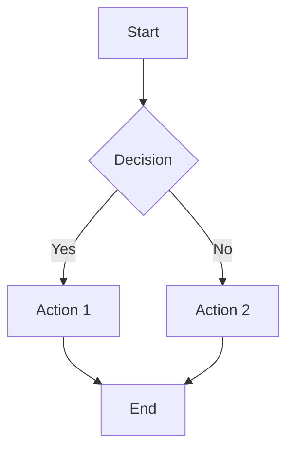
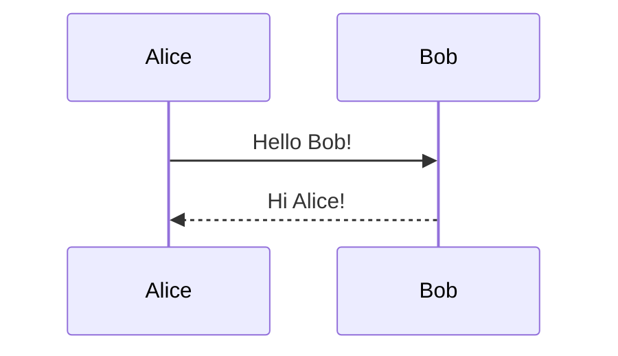
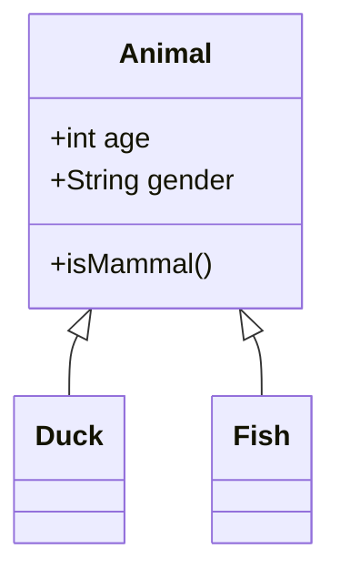
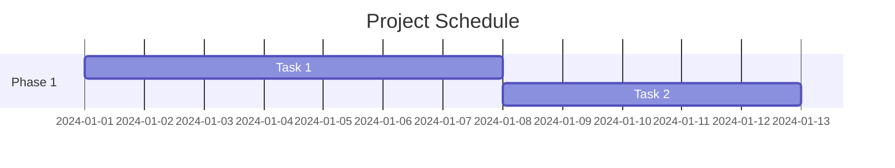
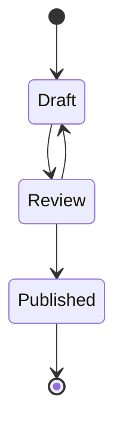

# Obsidian Markdown Extensions Reference

Complete reference for Obsidian's markdown syntax beyond standard CommonMark.

## Internal Links (Wikilinks)

### Basic Links

```markdown
[[Note Name]]                       # Link to note
[[Note Name|Display Text]]          # Link with alias
[[Folder/Note Name]]                # Link to note in folder
[[Note Name.md]]                    # Explicit extension
```

### Heading Links

```markdown
[[Note Name#Heading]]               # Link to heading
[[Note Name#Heading|text]]          # Heading link with alias
[[#Heading]]                        # Link to heading in current note
```

### Block Links

```markdown
[[Note Name#^block-id]]             # Link to specific block
[[Note Name#^block-id|text]]        # Block link with alias
[[#^block-id]]                      # Block in current note
```

### Creating Block IDs

```markdown
This is a paragraph that I want to reference. ^my-block-id

- List item ^list-block

> Quote block ^quote-block
```

## Embeds (Transclusion)

### Note Embeds

```markdown
![[Note Name]]                      # Embed entire note
![[Note Name#Heading]]              # Embed section under heading
![[Note Name#^block-id]]            # Embed specific block
```

### Image Embeds

```markdown
![[image.png]]                      # Basic embed
![[image.png|100]]                  # Width in pixels
![[image.png|100x200]]              # Width x Height
![[image.png|alt text]]             # Alt text (with pipe)
![[Attachments/photo.jpg]]          # From subfolder
```

### Other File Embeds

```markdown
![[document.pdf]]                   # Embed PDF
![[document.pdf#page=5]]            # Embed PDF at page
![[audio.mp3]]                      # Embed audio player
![[video.mp4]]                      # Embed video player
![[file.csv]]                       # Embed CSV as table
```

### External Embeds

```markdown
  # External image
  # External with width

# YouTube (auto-detected)


# Twitter/X

```

## Callouts

### Basic Syntax

```markdown
> [!note]
> This is a note callout.

> [!info] Title Here
> Content with **formatting**.

> [!warning]
> Warning message.
```

### Foldable Callouts

```markdown
> [!tip]+ Expanded by Default
> This content is visible initially.

> [!example]- Collapsed by Default
> Click to expand this content.
```

### Callout Types

| Type | Aliases | Description |
|------|---------|-------------|
| `note` | | Neutral information |
| `abstract` | `summary`, `tldr` | Overview or summary |
| `info` | | General information |
| `todo` | | Action items |
| `tip` | `hint`, `important` | Helpful suggestions |
| `success` | `check`, `done` | Positive outcome |
| `question` | `help`, `faq` | Questions or inquiries |
| `warning` | `caution`, `attention` | Potential issues |
| `failure` | `fail`, `missing` | Errors or missing items |
| `danger` | `error` | Critical warnings |
| `bug` | | Bug reports |
| `example` | | Examples or samples |
| `quote` | `cite` | Quotations |

### Custom Callout Icons

Via CSS snippet:

```css
.callout[data-callout="custom-type"] {
  --callout-color: 100, 150, 200;
  --callout-icon: lucide-sparkles;
}
```

### Nested Callouts

```markdown
> [!note] Outer
> Outer content
> > [!warning] Inner
> > Nested callout
```

## Tags

### Basic Tags

```markdown
#tag                                # Simple tag
#nested/tag                         # Nested/hierarchical tag
#tag-with-dashes                    # Dashes allowed
#tag_with_underscores               # Underscores allowed
#123                                # Numeric tags allowed
```

### Tag Restrictions

- Cannot contain spaces
- Cannot start with a number
- Case-insensitive matching
- Must follow word boundary

### Inline vs Frontmatter Tags

```markdown
---
tags:
  - tag1
  - tag2
  - nested/tag
---

This note has #inline-tag too.
```

## Frontmatter (YAML)

### Basic Frontmatter

```markdown
---
title: My Note Title
date: 2024-01-15
author: Your Name
---

# Content starts here
```

### Common Properties

```yaml
---
# Standard properties
title: Note Title
date: 2024-01-15
created: 2024-01-01
modified: 2024-01-15

# Tags and categories
tags:
  - tag1
  - tag2
category: Category Name

# Aliases for linking
aliases:
  - Alternate Name
  - Another Alias

# Custom CSS class
cssclass: my-custom-class
cssclasses:
  - class1
  - class2

# Publishing
publish: true
permalink: custom-url

# Custom properties
status: draft
priority: high
rating: 5
---
```

### Property Types

```yaml
---
# String
title: "String Value"

# Number
count: 42
rating: 4.5

# Boolean
published: true
draft: false

# Date
date: 2024-01-15
datetime: 2024-01-15T10:30:00

# List
tags:
  - item1
  - item2

# Inline list
tags: [item1, item2, item3]

# Object/Map
metadata:
  key1: value1
  key2: value2

# Multi-line string
description: |
  This is a multi-line
  string value.
---
```

## Comments

### Inline Comments

```markdown
This is visible. %%This is hidden.%%

More visible text.
```

### Block Comments

```markdown
%%
This entire block
is hidden from
the rendered view.
%%
```

## Math (LaTeX)

### Inline Math

```markdown
The equation $E = mc^2$ is famous.

Inline: $\sum_{i=1}^{n} x_i$
```

### Block Math

```markdown
$$
\frac{-b \pm \sqrt{b^2 - 4ac}}{2a}
$$

$$
\begin{aligned}
a &= b + c \\
d &= e + f
\end{aligned}
$$
```

### Common LaTeX Symbols

```markdown
Greek: $\alpha, \beta, \gamma, \delta$
Operators: $\sum, \prod, \int$
Relations: $\leq, \geq, \neq, \approx$
Arrows: $\to, \leftarrow, \Rightarrow$
Sets: $\in, \notin, \subset, \cup, \cap$
```

## Code Blocks

### Fenced Code

````markdown
```javascript
const hello = "world";
console.log(hello);
```
````

### Syntax Highlighting

Supported languages include:

- `javascript`, `js`
- `typescript`, `ts`
- `python`, `py`
- `bash`, `shell`, `sh`
- `json`, `yaml`
- `css`, `html`
- `sql`
- `markdown`, `md`
- And many more...

### Line Numbers (Plugin)

Some themes/plugins support:

````markdown
```javascript {1,3-5}
// Highlighted lines
const a = 1;
const b = 2;
const c = 3;
```
````

## Diagrams (Mermaid)

### Flowchart

````markdown

````

### Sequence Diagram

````markdown

````

### Class Diagram

````markdown

````

### Gantt Chart

````markdown

````

### State Diagram

````markdown

````

## Tables

### Basic Tables

```markdown
| Header 1 | Header 2 | Header 3 |
|----------|----------|----------|
| Cell 1   | Cell 2   | Cell 3   |
| Cell 4   | Cell 5   | Cell 6   |
```

### Alignment

```markdown
| Left     | Center   | Right    |
|:---------|:--------:|---------:|
| Left     | Center   | Right    |
```

### Extended Features

```markdown
| With Links | With Formatting |
|------------|-----------------|
| [[Link]]   | **bold** text   |
| `code`     | *italic* text   |
```

## Task Lists

### Basic Tasks

```markdown
- [ ] Uncompleted task
- [x] Completed task
- [ ] Another task
```

### Nested Tasks

```markdown
- [ ] Parent task
  - [ ] Subtask 1
  - [x] Subtask 2 (done)
  - [ ] Subtask 3
```

### Custom Status (Plugins)

Some plugins support extended status:

```markdown
- [ ] Todo
- [x] Done
- [/] In Progress
- [-] Cancelled
- [>] Forwarded
- [<] Scheduled
- [?] Question
- [!] Important
```

## Footnotes

### Inline Footnotes

```markdown
Here is a statement[^1] with a footnote.

[^1]: This is the footnote content.
```

### Multi-line Footnotes

```markdown
Complex footnote[^note].

[^note]: This footnote has multiple paragraphs.

    Second paragraph of the footnote.

    Even code blocks work:
    ```
    code here
    ```
```

## Highlights

```markdown
==Highlighted text== using double equals.
```

## Strikethrough

```markdown
~~Strikethrough text~~
```

## Horizontal Rules

```markdown
---
***
___
```

## External Links

### Basic

```markdown
[Link Text](https://example.com)
[Link with Title](https://example.com "Title")
```

### Auto-linking

```markdown
https://example.com          # Auto-linked
<https://example.com>        # Explicit auto-link
<email@example.com>          # Email link
```

## Dataview (Plugin)

### Inline Queries

```markdown
`= this.file.name`
`= date(today)`
`= this.tags`
```

### List Query

````markdown
```dataview
LIST
FROM #tag
WHERE file.mtime > date(today) - dur(7 days)
SORT file.mtime DESC
```
````

### Table Query

````markdown
```dataview
TABLE file.ctime AS "Created", status
FROM "Projects"
WHERE status != "archived"
SORT file.ctime DESC
```
````

### Task Query

````markdown
```dataview
TASK
FROM "Daily Notes"
WHERE !completed
GROUP BY file.link
```
````

## Templater (Plugin)

### Basic Template

```markdown
<%*
const title = await tp.system.prompt("Title?");
-%>
# <% title %>

Created: <% tp.date.now("YYYY-MM-DD") %>
```

### Common Functions

```markdown
<% tp.date.now("YYYY-MM-DD") %>
<% tp.file.title %>
<% tp.file.path() %>
<% tp.file.cursor() %>
<% tp.system.clipboard() %>
```

## Query Blocks (Core)

### Embed Search Results

````markdown
```query
tag:#important
```

```query
path:Projects
```
````

## Best Practices

### Link Formatting

1. **Use relative paths** - Works across devices
2. **Use aliases** - Cleaner in preview
3. **Avoid deep nesting** - Hard to maintain

### Frontmatter

1. **Consistent property names** - Case-sensitive
2. **Quote strings with colons** - YAML parsing
3. **Use lists for multiple values** - Better for queries

### Organization

1. **One topic per note** - Atomic notes
2. **Link liberally** - Build knowledge graph
3. **Use tags sparingly** - Avoid over-categorization
